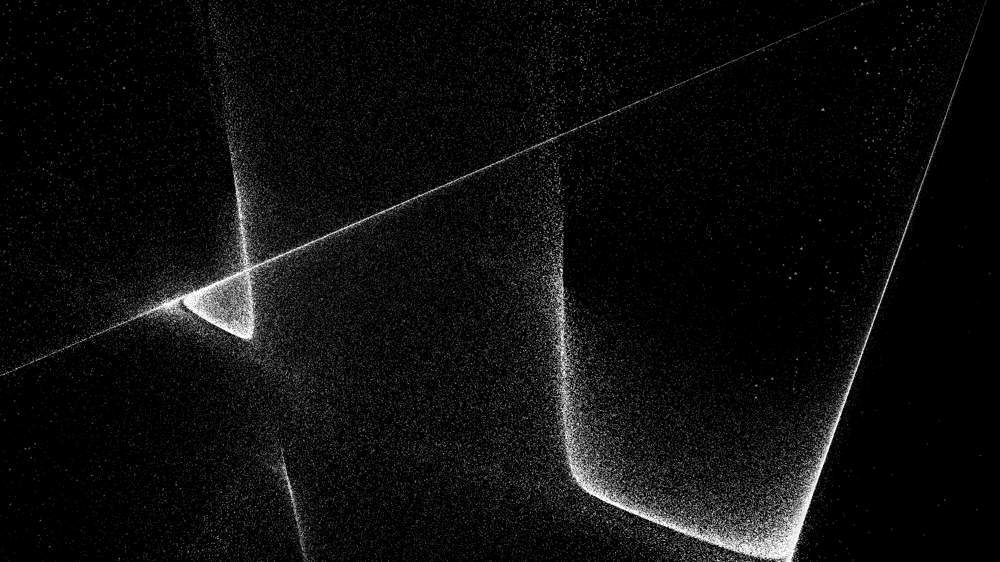

# Function sandbox



## About

Function sandbox is a program which displays a very large number of "grains of sand", where
each one is pushed around by some "wind", with the velocity of the wind at each point being determined
by a function of the point's coordinates.
It does all its computations on your GPU!

## Instructions

You can go to https://pommicket.itch.io/function-sandbox to get executables
for Windows/Linux.

On Linux you might need to install SDL2 (there's a very good chance you already have it installed). On Debian/Ubuntu,
you can do this with `sudo apt install 'libsdl2-2*'`.

Use W/A/S/D/Q/E or arrow keys/page up/page down to move.
You can check out the pre-installed sandboxes. Keep in mind that some of them use a very large number
of grains, so if your GPU isn't very good, it might not be able to handle some of them.
If you want to make your own sandboxes, check out `sandboxes/EXAMPLE.txt` for a well-documented
example.
I really recommend to just play around with functions and see what you get.
All the pre-installed sandboxes were just made with trial and error.

## Compiling it yourself

On Linux, install SDL2 with

```
sudo apt install libsdl2-dev
```

or equivalent, then run `make release`.
On Windows, download Visual Studio, [the VC development libraries for SDL2](https://libsdl.org/release/SDL2-devel-2.0.16-VC.zip),
add `vcvarsall.bat` to your PATH, then run `make.bat release`.

Alternatively, you can just compile `main.c` with any C compiler, making sure that `SDL.h` is in your include path (and you're linking with SDL2).

## Bugs

You can report a bug to `pommicket at pommicket.com`

## License

The code for function sandbox and all the example sandboxes are in the public domain.
